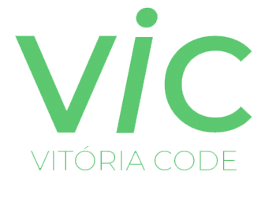

    Primeiro programa gratuito e online de formação e capacitação de mulheres em desenvolvimento mobile Android. 

<h1 align="center">
    
</h1>

O Projeto Vitória Code-VIC é uma ideia do [PicPay](https://www.picpay.com/), em parceria com a escola “[Elas Programam](https://elasprogramam.com.br/)” e apoio da "[Se Candidate, Mulher!](https://secandidatemulher.com.br/)”
